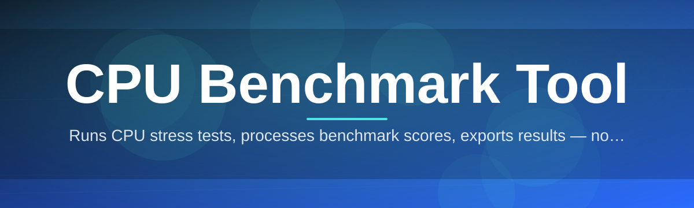
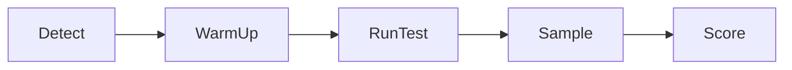

# cpu-benchmark-tool 🔥⚡

  

*Point it at your processor, hit run, get the truth — no telemetry, no fluff, no thirty-tab install wizard.*

  

---

## 🧠 Overview

**TL;DR:** A standalone Windows CPU benchmark tool that measures single-core, multi-core, and thermal-sustained performance in minutes — built by one dev who got tired of bloated suites.

`cpu-benchmark-tool` exists because most CPU benchmark tools on the market today are either locked behind account walls, stuffed with ad-supported "driver update" nonsense, or so bloated with UI chrome that a simple stress test takes ten minutes to configure. This is the opposite philosophy: a tight, purpose-built binary that spins up synthetic workloads — integer, floating point, cryptographic, and vectorized SIMD loads — and reports back hard numbers you can actually compare against your last build, your friend's rig, or that review site's chart.

It's built for the people who actually care about the number on the screen: overclockers validating a new curve, system builders benchmarking a batch of CPUs before shipping, homelab tinkerers deciding if that used Xeon is worth the eBay listing, and reviewers who need repeatable, exportable results without wrestling a spreadsheet. If you've ever asked "is my CPU actually performing at spec, or is it throttling under load," this tool answers that in the time it takes to make coffee.

Under the hood it treats your CPU like what it is — a finite thermal and clock budget — and it stresses that budget deliberately, in isolated phases, so the results actually mean something instead of being a fuzzy composite score you can't reason about.

## 🚀 Get It Now

> [!NOTE]
> The button above is the only official download source. The landing page always ships the current build — no third-party mirrors, no torrents, no "alternative hosting."

---

## 📦 What's In The Box

**TL;DR:** Eight capabilities, zero filler — every one of them earns its place in a CPU benchmark tool.

- **Single-Core Sprint Test** — measures raw IPC and clock responsiveness with a short, high-intensity integer/float mix, useful for spotting turbo-boost inconsistencies.

- **Multi-Core Saturation Test** — spins a worker thread per logical core and tracks aggregate throughput as core count scales, exposing scheduler and SMT quirks.

- **Sustained Thermal Run** — a longer-duration loop (5–30 min, configurable) that reveals whether your cooling solution actually holds the advertised boost clock or folds after four minutes.

- **SIMD & Vector Workloads** — AVX2/AVX-512-aware test paths so modern instruction sets get properly exercised instead of ignored.

- **Live Telemetry Overlay** — real-time clock speed, per-core utilization, package temperature, and estimated power draw, rendered while the test runs — not just at the end.

- **Score History & Comparison** — every run is timestamped and stored locally, so you can diff today's silicon against last week's BIOS update or thermal paste job.

- **Exportable Reports** — one click dumps a clean JSON/CSV report for spreadsheets, forum posts, or your own review pipeline.

- **Zero-Telemetry Design** — nothing phones home. What happens on your CPU stays on your CPU.

> [!TIP]
> Run the Single-Core Sprint first — it's the fastest way to sanity-check that the tool sees your CPU correctly before committing to a 20-minute sustained run.

---

## 🏁 How To Get Started

**TL;DR:** Visit the landing page, download, unzip, run. That's the whole onboarding flow.

1. Click the **DOWNLOAD NOW** button above to reach the official landing page.

2. Grab the latest Windows build — it's a single self-contained package, nothing to configure beforehand.

3. Extract it anywhere (Desktop, USB stick, wherever) and launch the executable directly.

4. Pick a test profile — Quick, Standard, or Sustained — and hit **Start Benchmark**. Results populate live and export on completion.

> [!IMPORTANT]
> Close background CPU-heavy apps (browsers with fifty tabs, game launchers, mining software) before a Sustained Run. They will absolutely skew your score, and this tool can't lie its way around a busy scheduler.

---

## 🖥️ System Requirements

**TL;DR:** Windows 10/11, a CPU, and nothing else. No dependencies, no runtime installs.

| Requirement | Minimum | Recommended |
|---|---|---|
| OS | Windows 10 (64-bit) | Windows 11 (64-bit) |
| CPU | Any x86-64 processor | Multi-core with AVX2 support |
| RAM | 2 GB free | 4 GB free |
| Disk | 150 MB | 300 MB (for report history) |
| Dependencies | None — standalone binary | None |
| Admin rights | Not required | Recommended for sensor readouts |

  

> [!NOTE]
> No installer, no registry writes, no background service. Delete the folder when you're done and the tool leaves nothing behind.

---

## ⚙️ How It Works

**TL;DR:** Detect hardware → warm up → run isolated test phases → aggregate → report. Five steps, no magic.

The pipeline is intentionally linear so results stay reproducible run to run:

1. **Hardware Detection** — enumerates logical/physical cores, cache topology, and supported instruction sets before touching anything.

2. **Warm-Up Phase** — a short throwaway load to get clocks out of idle state so your first "real" result isn't artificially low.

3. **Test Execution** — runs the selected workload profile (single-core, multi-core, SIMD, or sustained) in isolated phases.

4. **Telemetry Sampling** — polls clock speed, temperature, and utilization at fixed intervals throughout, not just at the end.

5. **Score Aggregation & Export** — normalizes raw throughput into a comparable score and writes the report.

---

## 🧩 Troubleshooting

**TL;DR:** Most issues trace back to background load, driver quirks, or overly aggressive antivirus heuristics — here's the fast fix list.

<strong>My score is way lower than benchmarks I see online for the same CPU.</strong>

Check for thermal throttling first — run the Sustained Test and watch the live clock overlay. If clocks nosedive after a minute or two, that's a cooling issue, not a tool issue. Also confirm nothing else is chewing CPU cycles in the background.

<strong>Windows Defender flagged the executable.</strong>

Benchmark tools that saturate all cores and read hardware sensors occasionally trip heuristic (behavior-based) antivirus flags — this is a known false positive category for this class of software. The binary is unsigned by nobody's budget but a one-dev project's; verify you downloaded it from the official landing page and allow it through if you're comfortable.

<strong>Temperature readings show 0°C or blank.</strong>

Some sensor data requires administrator privileges to read on certain motherboard chipsets. Relaunch the app as administrator and the telemetry overlay should populate correctly.

<strong>The app won't detect my hybrid P-core/E-core layout correctly.</strong>

Hybrid architectures are supported, but very new chip generations sometimes need a scheduler mapping update. Check the landing page for the current build version — this is one of the most actively patched areas of the tool.

<strong>Can I run this on a laptop?</strong>

Yes, but expect more clock variance due to power-plan throttling and thinner thermal headroom. Plug in AC power and set your power plan to "Best Performance" before running Sustained tests for consistent numbers.

<strong>My multi-core score doesn't scale linearly with core count — is that a bug?</strong>

No — that's just how CPUs work under real-world scheduling contention, memory bandwidth limits, and shared cache pressure. Perfect linear scaling basically never happens above 4-6 cores.

---

## 🎨 UI / UX Details

**TL;DR:** Dark and light themes, full keyboard control, and a settings panel that doesn't hide anything behind a paywall.

- **Themes** — Dark (default), Light, and a high-contrast Accessibility mode.

- **Keyboard Shortcuts:**

| Shortcut | Action |
|---|---|
| `Ctrl + R` | Start selected benchmark |
| `Esc` | Abort running test |
| `Ctrl + E` | Export last result |
| `Ctrl + H` | Open score history |
| `Ctrl + ,` | Open settings panel |
| `F1` | Open in-app help overlay |

- **Settings Panel** — control sampling interval, thread affinity, test duration, and export format (JSON/CSV) — all persisted locally between sessions.

- **Live Overlay Widgets** — draggable, dockable mini-panels for clock speed, temp, and utilization so you can arrange your monitoring layout however you like.

> [!TIP]
> Pin the telemetry overlay to a second monitor while gaming or rendering — it doubles as a lightweight always-on system monitor outside of benchmark runs too.

---

## 🤝 Contributing & Community

**TL;DR:** Solo-built, community-improved — issues and PRs are genuinely read and merged, not ignored in a backlog graveyard.

This started as a one-person project and stays maintained in that same spirit: fast iteration, no committee process, no bureaucracy. That said, contributions are welcome and taken seriously.

- Found a bug? Open an issue with your CPU model, OS build, and steps to reproduce.

- Got a feature idea? Discussions are open — workload profile suggestions and UI tweaks are especially welcome.

- Want to submit a PR? Keep changes focused and explain the "why," not just the "what."

> [!WARNING]
> This project does not accept pull requests that add telemetry, analytics SDKs, or ad integrations of any kind. That line is non-negotiable.

---

## 📄 License

**TL;DR:** MIT, 2026, do basically whatever you want with it.

Released under the [MIT License](LICENSE). Fork it, learn from it, ship your own spin on it — just keep the license notice